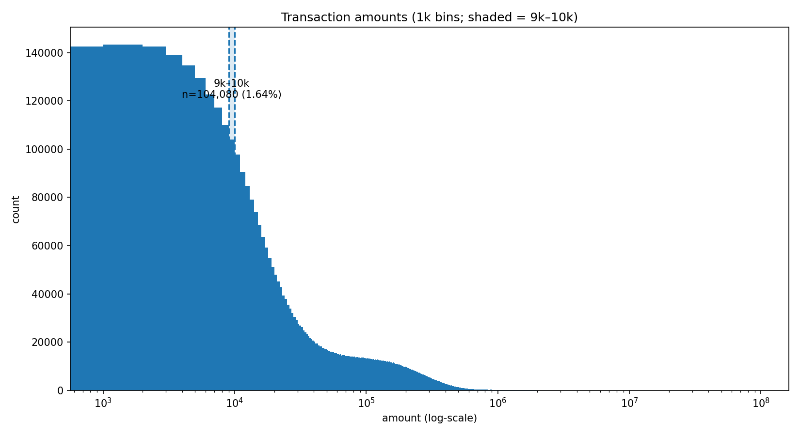
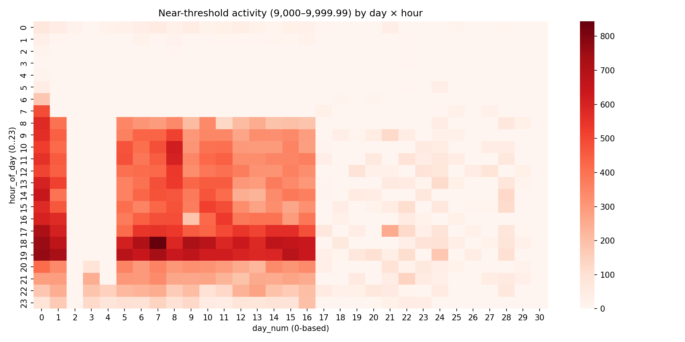
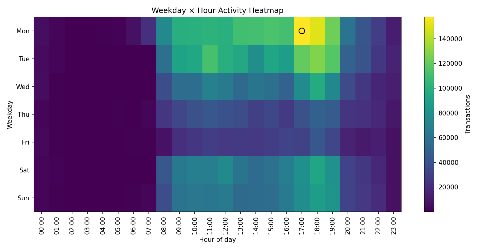

# FIU PaySim Case Study

## Overview
This repository contains a **Financial Intelligence Unit (FIU)** case study built on the **PaySim** synthetic transactions dataset.  
The project demonstrates how to detect structuring just below Anti-Money Laundering (AML) thresholds, identify anomalies using machine learning, and visualize **temporal risk windows**.

---

## Methodology
1. **Load dataset** into SQLite (`src/01_load_to_sqlite.py`).
2. **Feature extraction** using SQL queries (`sql/`).
3. **Python analytics** with Pandas, NumPy, Scikit-learn, Matplotlib.
4. **Visualization of suspicious patterns**:
   - Transaction clustering near **USD 10K AML thresholds**.
   - **Isolation Forest** anomaly detection.
   - **Temporal heatmaps** (weekday × hour).
5. **Reports and visuals** stored in the `reports/` directory.

---

## Visuals
> ⚠️ Note: large raw datasets are ignored from Git to stay under GitHub’s file limits.  
You can regenerate these visuals by running the scripts in `src/`.

### Distribution of Transaction Amounts

### Clustering near Thresholds

### Temporal Risk Windows

---

## Repository Structure
FIU-PaySim/
├── sql/                # SQL feature extraction queries
├── src/                # Python analytics scripts
├── reports/            # Visuals and structured outputs
├── requirements.txt    # Python dependencies
├── requirements.lock.txt
└── README.md

---

## References
- **FATF Recommendations (2012)**  
- **FINMA Guidance 05/2023 – Money Laundering Risk Analysis**  
- Lopez-Rojas, Elmir, Axelsson. *PaySim: A Financial Mobile Money Simulator*, EMSS 2016  
- **Dataset:** PaySim synthetic transactions (Kaggle “PaySim1”):  
  [https://www.kaggle.com/datasets/ealaxi/paysim1/data](https://www.kaggle.com/datasets/ealaxi/paysim1/data)
